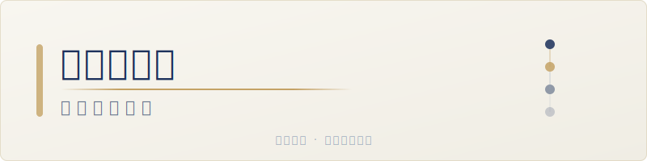
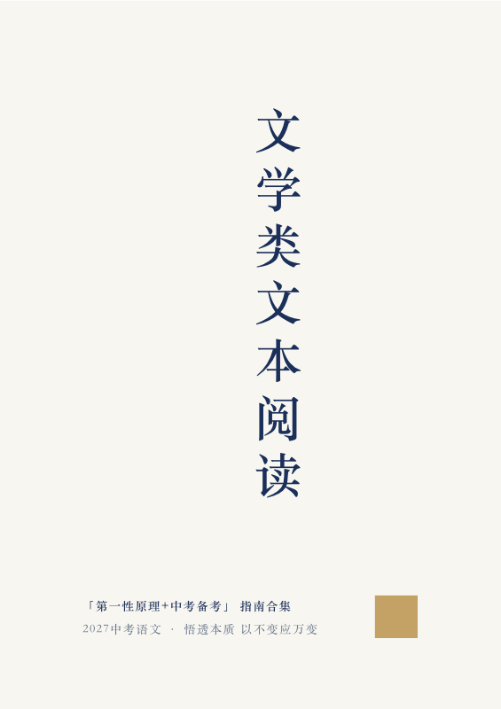
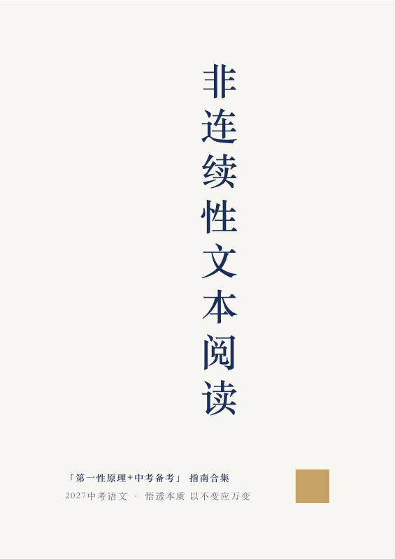
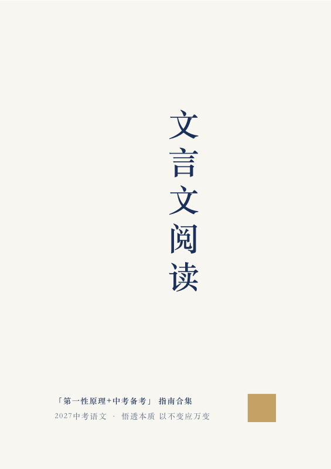
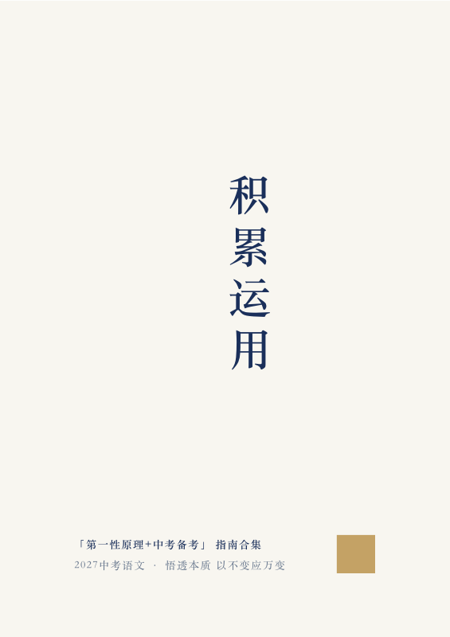
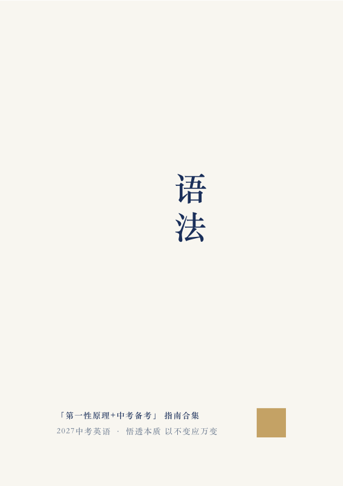

<p align="center">
  
</p>

<p align="center">
  <a href="#-为什么你需要这套指南"><strong>为什么</strong></a> ·
  <a href="#-里面有什么"><strong>目录</strong></a> ·
  <a href="#-下载"><strong>下载</strong></a> ·
  <a href="#-许可证"><strong>许可证</strong></a>
</p>

<p align="center">
  <strong>9 本 PDF · 语文+英语 · 2027 中考适用</strong>
</p>

<p align="center">
  <a href="https://github.com/duyuxuan/zhongkao-first-principles/stargazers">
    
  </a>
  
  
  
</p>

---

## 🤔 为什么你需要这套指南

**如果你正在经历这些——**

- 阅读理解明明看懂了文章，赏析题却总被扣一半分
- 文言文课内注释背得滚瓜烂熟，课外篇一上来就懵
- 作文写了 600 字，到手只有 35 分，不知道差在哪
- 英语语法规则背了三年，单选还是错三四道
- 完形填空排除了两个选项，剩下一对一错永远选那个错的

**——问题不在你不够努力，在你还没看清每道题背后的"为什么"。**

大多数备考资料教你"怎么答"——套这个模板、背那个公式。但题目稍微变一下，模板就失效了。

这套指南不一样：**它从第一性原理出发，先让你理解每类题的本质，再从本质推导出方法。** 当你知道一道题"为什么要这样答"，你就再也不需要死记答题模板——因为正确的答法，变成了唯一符合逻辑的选择。

| 你以前可能这样学 | 这套指南教你的方式 |
|----------------|-----------------|
| 背"赏析题 = 手法+内容+情感"的模板 | 理解**形式+内容=效果**这个核心公式 → 所有题型都是它的自然推导 |
| 记 120 个文言实词的义项清单 | 掌握**课内迁移+语境推断**的解码方法 → 从已知推导未知 |
| 把语法当成 100 条独立规则背诵 | 理解**英语是"标记驱动"语言** → 从句法骨架出发，词法是填充 |
| 背"总-分-总"的作文框架 | 理解阅卷老师**90 秒内的认知路径** → 结构、语言、立意的选择都有了依据 |

> **不是模板告诉你该写什么，而是逻辑告诉你该写什么。**

---

## 📚 里面有什么

### 语文系列

<p align="center">
  <a href="output/语文·文学类文本阅读全指南.pdf"></a>
  <a href="output/语文·非连续性文本阅读全指南.pdf"></a>
  <a href="output/语文·文言文阅读全指南.pdf"></a>
  <a href="output/语文·积累运用全指南.pdf"></a>
  <a href="output/语文·作文全指南.pdf"></a>
</p>

| 书名 | 核心公式 | 你会学到 |
|------|---------|---------|
| **文学类文本阅读** | 形式 + 内容 = 效果 | 赏析题/作用题/含义题/概括题——四种题型一个公式通解 |
| **非连续性文本阅读** | 所有答案皆在原文 | 选择题九大错误类型、信息提取与整合、图文转换 |
| **文言文阅读** | 课内迁移 + 语境推断 | 120 实词体系全解、虚词每种用法、翻译六字诀、断句技法 |
| **积累运用** | 科学记忆 + 系统归类 | 间隔重复/主动回忆/错题本使用法 + 字音字形成语病句标点默写全模块 |
| **作文** | 被看见 + 被理解 + 被打动 | 审题逐词分析法、六种叙事结构（含双线结构）、满分范文拆解 |

### 英语系列

<p align="center">
  <a href="output/英语·听力全指南.pdf"></a>
  <a href="output/英语·语法总指南.pdf"></a>
  <a href="output/英语·阅读总指南.pdf"></a>
  <a href="output/英语·写作全指南.pdf"></a>
</p>

| 书名 | 核心公式 | 你会学到 |
|------|---------|---------|
| **听力** | 预判 + 定点捕捉 | 四大题型满分策略、场景预判法、同义替换识别、易错陷阱排除 |
| **语法** | 从句子出发，词填入骨架 | 五句型→时态语态→三大从句→非谓语→词法，语法填空技巧 |
| **阅读** | 所有答案皆在原文 | 完形四步法、阅读四大题型（细节/推理/主旨/词义）模板、任务型阅读 |
| **写作** | 审→列→连→润→查→抄 | 万能三段框架、30+ 高分句型、6 大话题词汇库、3 篇完整范文 |

---

## 🗺️ 全科规划

### 当前进度

| 学科 | 已完成 | 计划中 |
|------|--------|--------|
| **语文** | 5 本 | 古诗鉴赏、名著阅读、说明文/议论文阅读 |
| **英语** | 4 本 | 单词记忆方法论、完形填空专项 |
| **数学** | — | 代数/几何/函数/概率统计四大模块 |
| **物理** | — | 力学/电学/热学/光学，实验探究专项 |
| **化学** | — | 物质构成/化学方程式/溶液/酸碱盐 |
| **历史** | — | 中国古代史/近现代史/世界史，材料题专项 |
| **道德与法治** | — | 国情/法律/心理/道德四大板块 |

> **全部科目都遵循同一套方法论**：从第一性原理出发 → 提炼核心公式 → 推导题型解法 → 实战演练验证。

### 语文 · 待写内容

| 计划书目 | 内容方向 |
|---------|---------|
| **古诗鉴赏全指南** | 意象/意境/手法/情感四维分析法，课标 61 首逐首拆解 |
| **名著阅读全指南** | 12 部必读名著人物/情节/主题速查，跨文本对比探究 |
| **说明文/议论文阅读** | 说明方法/论证方法，信息筛选与逻辑链分析 |

### 英语 · 待写内容

| 计划书目 | 内容方向 |
|---------|---------|
| **单词记忆全指南** | 词根词缀法/艾宾浩斯循环/场景分类记忆，中考 1600 词分组速记 |
| **完形填空专项** | 语境推断技巧进阶，高频同义替换词典，10 大话题分类训练 |

---

## 📥 下载

所有 PDF 在 `output/` 目录下，可直接下载或打印：

```
output/
├── 语文·文学类文本阅读全指南.pdf    (2.1 MB)
├── 语文·非连续性文本阅读全指南.pdf  (0.7 MB)
├── 语文·文言文阅读全指南.pdf        (1.0 MB)
├── 语文·积累运用全指南.pdf          (0.9 MB)
├── 语文·作文全指南.pdf              (0.9 MB)
├── 英语·听力全指南.pdf              (1.9 MB)
├── 英语·语法总指南.pdf              (0.7 MB)
├── 英语·阅读总指南.pdf              (2.0 MB)
└── 英语·写作全指南.pdf              (0.8 MB)
```

---

## 🎯 适合谁用

- **2027 年中考考生**（也兼容 2026 及后续年份）—— 初三冲刺、初二提前备考都适用
- **陷入"刷题→遗忘→再刷题"循环**、想从根本方法上突破的学生
- **语文/英语教师** —— 可作为课堂补充教材，第一章的"第一性原理"思路尤其适合破除学生的模板依赖
- **想帮孩子建立高效学习方法的家长** —— 第二章的记忆方法论可直接用于所有学科

---

## 💡 怎么用效果最好

1. **从你最痛的那本开始。** 哪里丢分最多，先读哪本。急所优先。
2. **每本必读第一章。** "第一性原理"是整本书的思维底座，理解了这个，后面的方法才是你自己的。
3. **看"满分示例"时先遮住答案。** 自己先想一遍，再看书上的分析，对比差距在哪。
4. **第十章速查表是用来考前翻的。** 考前一周，每天花 10 分钟翻一本的速查表，重点看自己常错的知识点。
5. **错题本按书里的格式做。** 不只是抄题和答案——重点写"我当时为什么错了"和"正确的判断逻辑"。

---

## ⭐ 如果这套指南对你有帮助

如果你觉得这套指南有用，请给这个项目点一个 **Star** ⭐

- **Star** 是对持续更新最大的鼓励
- **Fork** 可以保存到你自己的仓库随时翻看
- **Share** 分享给一起备考的同学，好的方法值得被更多人知道

有任何建议或反馈，欢迎提 [Issue](https://github.com/duyuxuan/zhongkao-first-principles/issues)。

---

## 📬 联系作者

- **微信**：`weixin_duyuxuan`
- **邮箱**：[2702922146@qq.com](mailto:2702922146@qq.com)

---

## ⚠️ 声明

- 本书内容由 Duyuxuan 与 AI 协作完成，仅供学习参考。
- 中考政策和题型每年可能微调，请结合当年考试说明使用。
- 源文件（Markdown）及构建脚本不开源，仅提供成品 PDF。

## 📄 许可证

本项目 PDF 文件采用 [CC BY-NC-SA 4.0](https://creativecommons.org/licenses/by-nc-sa/4.0/) 许可。

**你可以：** 自由下载、打印、分享给同学
**不可以：** 用于商业用途（售卖、付费课程等）
**必须：** 署名原作者，并以相同方式共享

---

<p align="center">
  <sub>悟透本质 · 以不变应万变</sub>
</p>
